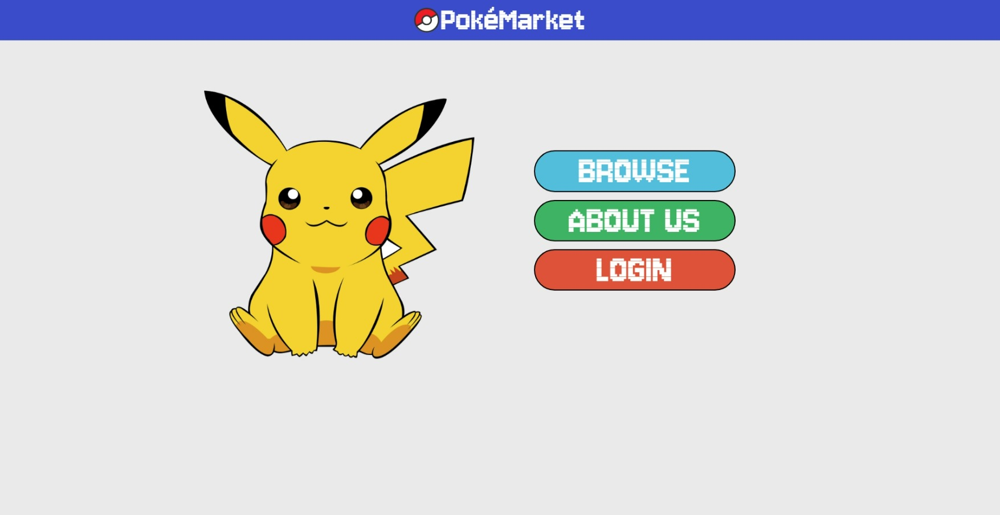
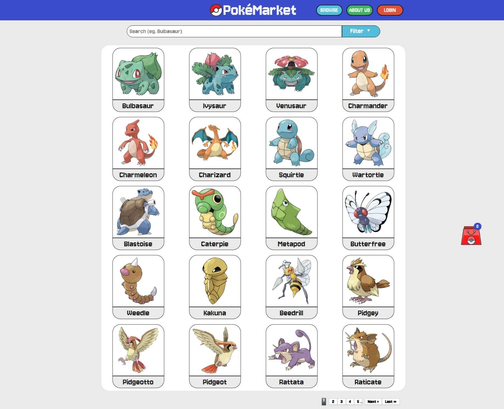
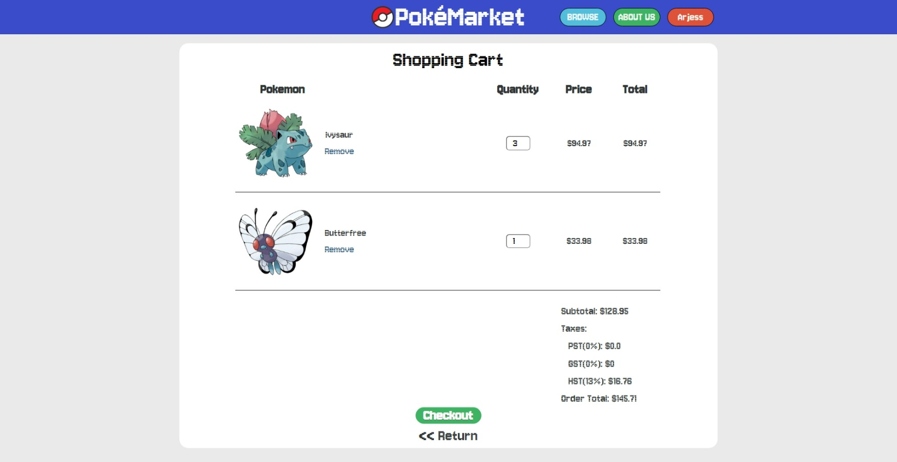

# Pokemon Market E-Commerce Project


### Proposal
At Pokemon Market, we specialize in first-generation Pokémon , ensuring a convenient and efficient shopping experience for all your Pokémon  needs. Our slogan is "*Unleash your inner trainer: Pokemon Market - Where catching dreams meets catching deals.*" We are committed to delivering top-notch first generation Pokémons with questionable ethics.

### Routes
* Homepage
* Browse
* About us
* Pokemon details
* Shopping cart
* User detail modifcations

### Features Implemented
* Homepage with easy navigation
* Login/Register for new and existing users
* *Add to Cart* option while hovering over a pokemon in the browse page
* Browse pagination
* Search bar with filters (Type, On Sale, and Recently Added)
* Functioning shopping cart
* Active Administration with the use of the Active Admin gem (CRUD for User and Pokemon modifications)
* Implemented 3rd party payment processing through Stripe

## Preview
### Homepage

### Pokemon Browse

### Shopping Cart


## Requirements
* Ruby v3.1.2

## Instructions to run this project on your system
1. Confirm Ruby version matches with the requirements.
2. Clone the Project.
3. Navigate to the project's folder via command line.
4. Run ```bundle install```.
5. Next, run ```rails db:seed```.
6. To start the project, run ```rails s```.

## Disclaimer
The resources provided in this repository, including any software or configurations, are intended for personal practice and educational purposes only. It is not recommended to use them in a production environment or any critical system.